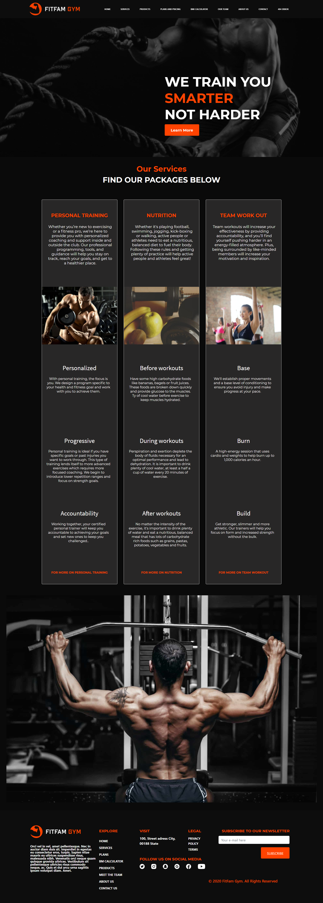

**Collaboration Instructions:**

    1. Clone this repository to your local PC.
    2. Your assets such as images, CSS file, JavaScript file should be placed in the Images, CSS, Javascript folders respectively in the assets folder.
    3. Use 90% botstrap for your styling.
    4. Ensure responsiveness in your designs. **Important** .
    5. Create a new branch locally name it according to the the instruction on the user story
    6. Once you are done working run "git pull" locally.
    7. Push your code to the repository.
    8. Make a Pull request for the master branch. 

## Design
    https://www.figma.com/file/hPBHR7aVZf8sTS21RTcUps/Gym%2FFitness-Variation-2?node-id=63%3A13

# Project Envato by Team Avengers - Gym/Fitness Website

##  Deployment

The application was deployed to netlify.

##  Built With

*  HTML
*  CSS
*  JavaScript
*  Bootstrap

##  Authors

* **Wendy Munyasi**  (https://github.com/wendymunyasi) - Slack Username: **@__wendy**
* **Emmanuel Ayo**  (https://github.com/AyManuell) - Slack Username: **@Berlin**
* **Ofili Chukwuema Timothy**  (https://github.com/chumex412) - Slack Username: **@JElite**
* **Olabode Olaniyi David**  (https://github.com/Nierowheezy) - Slack Username: **@Niero**
* **Olaide Gbeyide** (https://github.com/olaidegbeyide) - Slack Username: **@Olaide**
* **Tony Ouma** (https://github.com/TonyOuma) - Slack Username: **@Ouma**
* **Ikechukwu okonkwo** (https://github.com/Afej) - Slack Username: **@Afej**

##  License

This project is licensed under the MIT License.

## Project-Setup Instructions.

1. git clone using the following links.

   link: https://github.com/hngi/NEW-AVENGERS-VARIATION-2-GYM-FITNESS.git

2. Naviagte to the `NEW-AVENGERS-VARIATION-2-GYM-FITNESS` directory then `src` directory.
3. Open the file `index.html` to view the app on your browser.

## BDD

| Behaviour | Output |
| --------- | ------ |
|On loading the app you see the services page showing services available|Not Applicable.|
|Clicking `Home` link on the navigation bar|You are redirected to the home page.|
|Clicking `Services` link on the navigation bar|You are redirected to the services page where you view the services the gym has to offer.|
|Clicking `Products` link on the navigation bar|You are redirected to the products page where you view the facilities the gym has to offer.|
|Clicking `Plans and pricing` link on the navigation bar|You are redirected to a page where you view various plans the gym has to offer at various prices.|
|Clicking `BMI calculator` link on the navigation bar|You are redirected to a page where you can be able to calculate your BMI.|
|Clicking `Our team` link on the navigation bar|You are redirected to a page where you can view the members of the gym and trainers.|
|Clicking `About Us` link on the navigation bar.|You are redirected to a page where you view the story of the gym and so much more.|
|Clicking `Contact Us` link on the navigation bar.|You are redirected to a page written various ways you can use to contact us.|

## Sample Screenshot of a Part of the website

    

